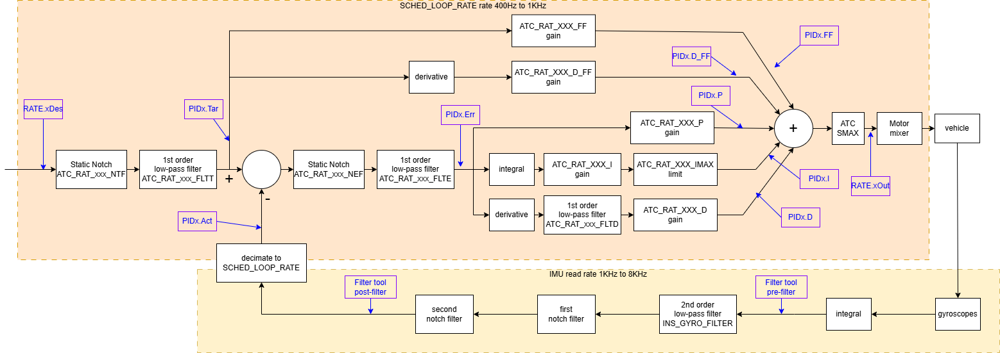

# PID Review

A browser-based tool for analysing ArduPilot flight logs and evaluating PID tuning quality.

## Requirements

The **PID** bit of the `LOG_BITMASK` parameter should be set before flying so that `PIDx` log messages (`PIDR`, `PIDP`, `PIDY`, `PIQR`, `PIQP`, `PIQY`, `PIDS`, `PIDA`) are recorded.
Without this the tool will fallback to using the less detailed `RATE` messages and will disable some features.

## Supported vehicles

| Vehicle | Axes / controllers |
|---------|--------------------|
| Copter | Roll, Pitch, Yaw rate PIDs (`PIDR/P/Y`) and raw RATE (`RATE R/P/Y`) |
| Plane | Roll, Pitch, Yaw rate PIDs (`PIDR/P/Y`), VTOL rate PIDs (`PIQR/P/Y`) and VTOL RATE |
| Rover | Steering rate (`PIDS`) and speed (`PIDA`) controllers |

### ArduCopter angle rate control loop

For this vehicle type, here is the annotated signal diagram:

## How to use

1. Open the tool in a browser and load a `.bin` log file using the file picker.
2. Select the axis / controller to analyse using the radio buttons in the **Axis** panel.
3. Optionally narrow the analysis window using the **Start / End** time inputs or by zooming into the **Flight Data** plot and dragging the range slider.
4. Click **Calculate** to run the FFT. The button is re-enabled automatically whenever the time range or window size is changed.

## Plots

### Flight Data

Overview of roll, pitch, throttle and altitude for the whole flight.
Use the range slider to set the analysis time window.

### Time Domain

- **Inputs** – target, actual and error signals in the time domain, in deg/s.
- **Outputs** – individual PID components (P, I, D, FF) and total output in the time domain.

Multiple test sections (caused by in-flight parameter changes) are shown with coloured background rectangles and can be toggled on/off individually in the **Tests** table.

### Frequency Domain (FFT)

Averaged windowed FFT of the selected PID signals over the chosen time range.
Each signal (Target, Actual, Error, P, I, D, FF, DFF, Output) can be shown or hidden independently.

- **Amplitude scale** – Linear, dB, or Power Spectral Density (PSD).
- **Frequency scale** – Linear or logarithmic, in Hz or RPM.
- **Window size** – Controls FFT frequency resolution; must be a power of two. Changing it re-enables the Calculate button.

The **Logging rate** and **Frequency resolution** fields below the checkboxes reflect the actual sample rate and bin width of the computed FFT.

### Rate PID Target Filters *(Roll / Pitch / Yaw axes only)*

These filters remove noise from the desired PID target input.
The (optional) low pass filter limits the bandwidth of the PID input signal.
The (optional) notch filter removes vehicle frame resonance (RPM independent noise).

This graph shows the effect of the **target filters** (`ATC_RAT_xxx_FLTT` and `ATC_RAT_xxx_NTF`) by overlaying:

- **Unfiltered target** – the raw rate demand from the `RATE` log message (`RDes`, `PDes`, `YDes`), processed at the RATE message sample rate.
- **Filtered target** – the demand after the target filter, as seen by the PID controller (`PIDR/P/Y.Tar`).

### Rate PID Error Filters *(Roll / Pitch / Yaw axes only)*

These filters remove noise from the calculated control-loop error signal.
The (optional) low pass filter limits the bandwidth of the error signal.
The (optional) notch filter removes vehicle frame resonance (RPM independent noise).

This graph shows the effect of the **error filters** (`ATC_RAT_xxx_FLTE` and `ATC_RAT_xxx_NEF`) by overlaying:

- **Unfiltered error** – the raw error (Tar − Act) computed from the PID log message, before the error filter.
- **Filtered error** – the error after the filter, as used by the PID controller (`PIDR/P/Y.Err`).

Both filter plots share the same frequency axis zoom/pan as the main FFT plot.

### Step Response *(Roll / Pitch / Yaw axes only)*

Estimates the closed-loop step response from the flight data using a Wiener-filter / transfer-function approach between the target and actual signals.
Individual window estimates are shown in grey; the mean response is shown as a coloured line.
Useful for evaluating rise time, overshoot, and overall damping without requiring a dedicated step-input manoeuvre.

### PID Spectrogram

Time–frequency heatmap of the selected PID component.
Shows how the spectral content of the control signal evolves throughout the flight, making it easy to spot resonances that appear only at certain throttle levels or flight phases.
